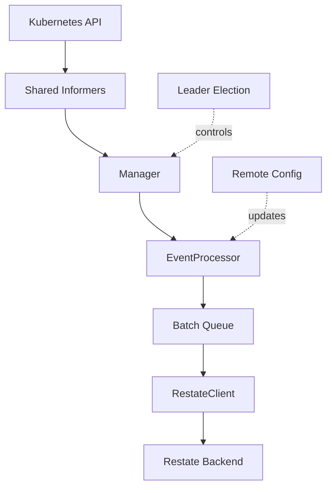

# Kubernetes Watcher

A high-performance, resilient, and enterprise-ready Kubernetes agent designed to observe pod failures and notify a central management plane.

## Key Features

- **High Availability**: Built-in leader election using Kubernetes Leases to ensure only one instance is active per cluster.
- **Dynamic Fleet Management**: Automatically enrolls clusters and fetches remote configurations at runtime.
- **Efficient Observation**: Uses Shared Informers and dynamic namespace discovery (via labels) to scale to thousands of pods.
- **Process Resilience**: Implements circuit breakers and exponential backoff to protect against backend saturation.
- **Cloud-Native Observability**: Integrated Prometheus metrics, JSON structured logging, and pprof debugging.

## Project Structure

- [`cmd/server/`](cmd/server/): Main entry point. Handles signal handling, leader election, and the HTTP health/metrics server.
- [`internal/config/`](internal/config/): Configuration management using Viper (YAML, Env, Flags).
- [`internal/kubernetes/`](internal/kubernetes/): Core logic for watching resources and processing events (filtering, deduplication, batching).
- [`internal/restate/`](internal/restate/): Resilient client for communicating with the Restate backend.
- [`internal/metrics/`](internal/metrics/): Prometheus metric definitions.

## Getting Started

### Development

```bash
# Build the binary
make build

# Run locally (requires KUBECONFIG)
./bin/watcher --restate-url "http://localhost:9090" --cluster-id "dev-001"
```

### Configuration

The watcher is configured via `config.yaml`, environment variables, or flags. See [`internal/config/README.md`](internal/config/README.md) for details.

## Observability

- **Metrics**: Available at `:8080/metrics`
- **Health**: Liveness/Readiness probes at `:8080/healthz` and `:8080/readyz`
- **Profiling**: pprof available at `:8080/debug/pprof`
- **Audit Logs**: Processor generated structured logs marked with `AUDIT EVENT`.

## Architecture


